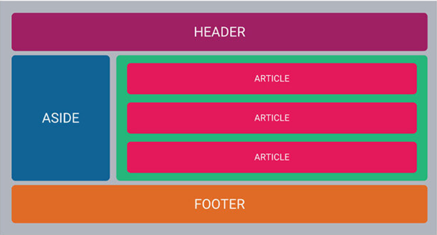

# 🔭 Build the Wireframe with Flexbox

## Instructions

### Part 1

+ [x] Create your project and its GitHub repository with the name of flexbox-wireframe-practice
+ [x] Create index.html at the root level of your project
+ [x] In index.html, change the title element's text to Flexbox Wireframe Practice
+ [x] Create a folder called css
+ [x] Create a file within the css folder named style.css
+ [x] Create a file within the css folder named reset.css
+ [x] Paste the CSS from the reset below into reset.css
+ [x] Link your reset to either your HTML or import it at the beginning of your style.css file. There are examples below of how to do this
+ [x] Save the following image as mobile-wireframe.png and place it in the root level of your project

    
+ [x] Recreate and style the layout from the wireframe below as best as you can
+ [x] Submit the link to your repository once all work is completed and pushed to GitHub

### Part 2

+ [x] Open up your existing project called flexbox-wireframe-practice
+ [x] Save the following image as desktop-wireframe.png and place it in the root level of your project

    
+ [x] Update style.css to include a media query that will update the page's layout to match the wireframe below as much as possible
+ [x] Submit the link to your repository once all work is completed and pushed to GitHub
